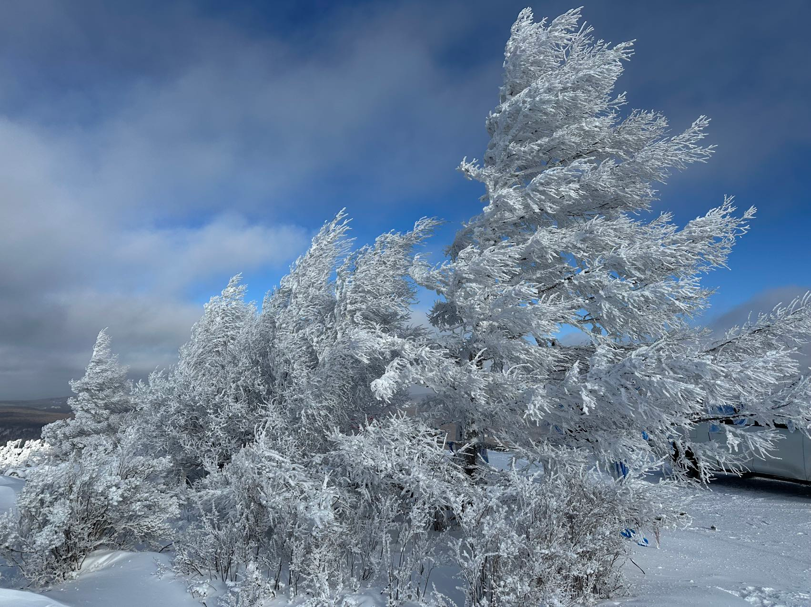
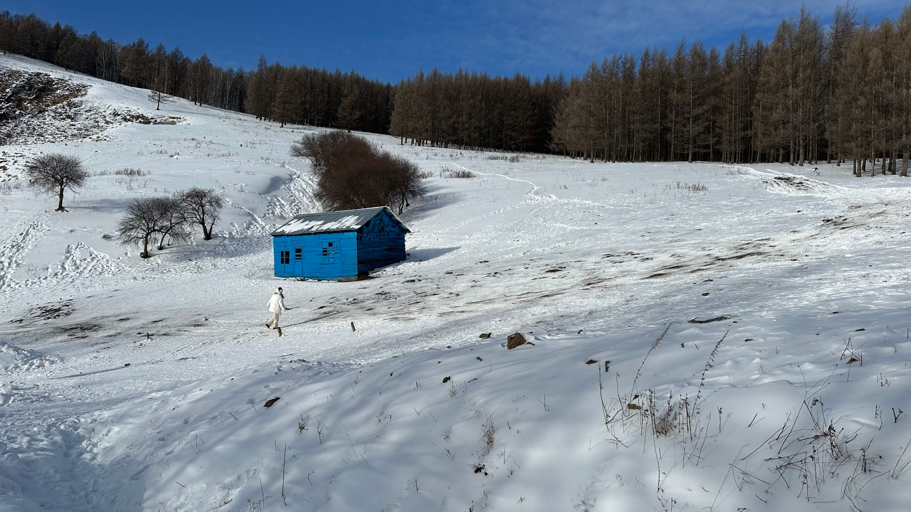

# 一人阿尔山

24年在北京加了一年的班，新的一年，元旦当天来一次不特种兵的旅游，换换脑子。

早上首都机场坐飞机经乌兰浩特转机往阿尔山。

乌兰浩特往阿尔山做了这个小飞机，机票¥80，最多坐6人，两个工作人员包括一个飞行员再加上各种其他成本，感觉会赔本的吧。

第一次坐这种小飞机，机舱内很小，不过座位比我的廉航的经济舱宽敞多了

出了阿尔山机场后，在大门口随口问了两个人是不是打车去阿尔山市区，听到肯定的答复后，问他们要不要一起打车拼车，后我出¥30，他们两个一人¥20回到市区。  
到市区后他们下车就剩我自己，师傅问来这边旅游吗？我是是的，他递给我一张名片，说有需要联系我。我收下说好。

## 阿尔山

回酒店，窗外

> 北方的地暖实在太给力了，到了房间衣服脱到只剩下背心，依然一直出汗，无奈只好把窗户开一条小缝。

### 阿尔山 citywalk

酒店放好行李后，出门大街上闲逛

阿尔山最有名的景点可能就是火车站了吧

晚上去吃了铁锅炖，点了小份小量，刚开始吃味道不错，后面越吃越咸，吃不下。

> 吃饭结账时送的一瓶“沙棘汁”饮料，十分好喝

### 白狼雾凇

去白狼一路两侧的风景绝美，忍不住从后排换到前排录视频，包车师傅应该是蒙古族，视频BGM一直放着蒙古民族歌曲。

雾凇沆砀

白狼峰风太大了，相机手机相继关机，无法记录美好

**阿尔山地质博物馆**  

白狼回来时间很早，选择逛一下市区的阿尔山地质博物馆，里面可以看到很多关于大兴安岭和阿尔山国家森林公园的地质知识，第二天去石塘林和三潭峡等地处处对应。

晚饭吃了蒙古特色：冰煮羊，肉好嫩，不知道是因为冰水煮升温慢还是纯粹肉比较好

阿尔山雪村，小小的，也很可爱

### 森林公园

出发第一站：驼峰岭天池，第一次来到这种景点，还是挺漂亮的，不知道长白山天池会多美，等以后有机会再比较吧。

之后去看了大峡谷之后，景区摆渡车师傅说大雪天各个点都一样，基本上看两个你就不想看了。

但由于我这次阿尔山之旅时间比较充足，每个景点最后还都逛了一遍，司机也没有不耐烦，还不错。

杜鹃湖、石塘林、地池、三潭峡，然后到天池服务区休息

**天池服务区**  

整个景区里唯一还在营业的地点，当然晚上住宿也是在这个服务区。

服务区里有一些宾馆和饭店，不过基本都已关门过冬。白雪覆盖每一片土地，有烟囱，有小巷，甚至有小时老家冬天的感觉。

宾馆窗户外景，森林里的暖气果然不如市区，睡觉需要穿着睡衣方可不冷。

**不冻河**  

哈拉哈河，在森林公园有一段因为地质原因长年不冻，所以叫不冻河。  
也听包车大哥讲：日本人占领东北时砍伐大兴安岭的树，都会通过这条河运往下游，当年这条河流量应该很大吧。

无心栽柳柳成荫，这些在河里觅食的牛天然形成了景色，只是不知道这些牛会不会是景区的演员

第二天早上早起床，又去不冻河看日出，中间走到了一片没人走过的地方，雪顿时能埋住整条腿，事后想起来就担心，万一有个窟窿，可能就下去了。。

**天池**  

回酒店吃了个早饭，咸菜就花卷，饭后爬天池，整个来回，荒无一人，想到整个偌大的景区，昨晚到早上可能就只有我一个游客，体验还是蛮特别的。

上山时木栈道栏杆上面的积雪，完美的像是刚烤好的长条面包，下山时只能看到光秃秃的栏杆以及我湿漉漉的首套。

**回市区**  

给包车师傅多加了¥50，回程路上带我沿路停车观景

乌苏浪子湖，下湖时跑了一下，一脚踩到蓬松的雪，摔了一跤，胳膊撑地，这胳膊怕是几个月不能着力了

小红书真是带货王，小房子前的姑娘，来回奔跑，抓拍~

和师傅沟聊到五里泉，说那边也停一下，我想接一瓶泉水尝尝，师傅表示没问题；  
走到伊尔施，师傅说给别人帮忙拉一个人，我同样表示没问题。  
结果那个阿姨上车后一通嫌弃：怎么还有别人啊，师傅说伊尔施现在没有车，我这个车还是因为帮忙才顺道拉你，不行你可以再打别的车。阿姨去阿尔山火车站，时间很赶。我无法理解，我也担心会不会因为赶车错过五里泉。  
快到五里泉时师傅说我先下去逛，送完这个阿姨再来接我，我说好。

下车就发现有很多人接水，甚至接完水直接吨~吨~吨~

我也接了一瓶五里泉的泉水，带到沈阳才拿出来喝，口感挺好的，比农夫山泉有点儿甜

临走前问师傅推荐，吃了碗日常牛肉面，味道还不错

火车站对面的雪雕，预祝蛇年大吉

mini候车室

## 沈阳

第一次卧铺，整体体验还算不错，适合穷人。

**小河沿早市**  

5点多抵达沈阳站，地铁到中街步行街，出站后天依然黑着，没有可逛的。  
由于时间还早，选择腿着去小河沿早市。早市很有烟火气，有点儿小时候老家赶集的味道~

**辽宁省博**  

早就知道辽宁省博馆藏很多书画，一部分原因是溥仪退位后偷运往满洲国，45年逃跑时被俘，后收藏于`东北博物馆`。
由于没有多做攻略，到现场才知道有展出《洛神赋图卷》，排队一小时，观看一分钟，体验只能说比故宫的个别展出强。
