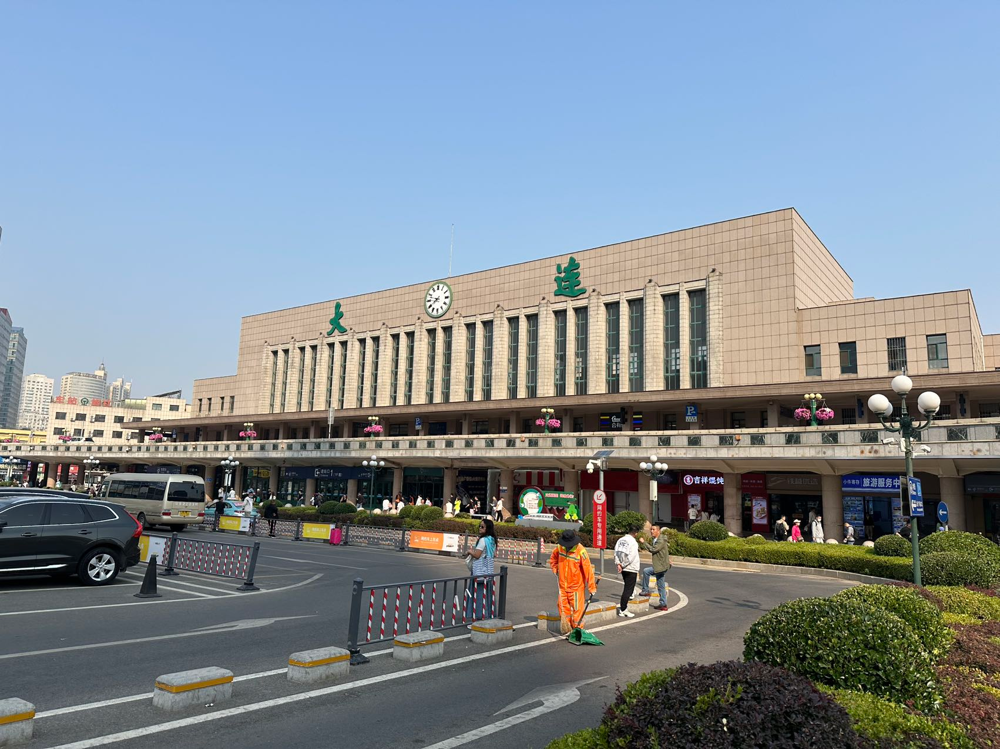
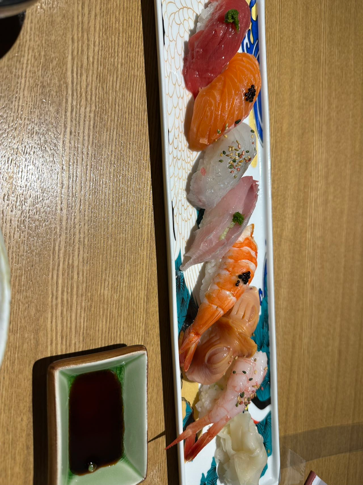
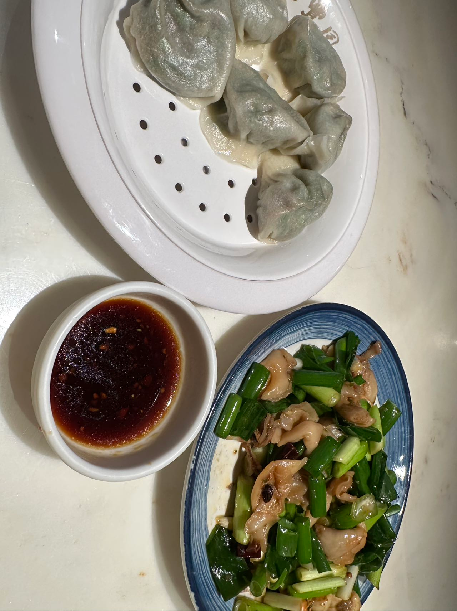

# 大连端午游记

绕了渤海一个大圈，睡了一个晚上到大连，越来越喜欢卧铺去旅行了

大连火车站旁边没看到吃早饭的，就直接地铁前往旅顺

## 旅顺

除了地铁站，看着好荒凉，在路边找了个饭馆，吃了份水饺，打车去黄渤海分界线

### 黄渤海分界线

这块的海好蓝

很清楚的黄渤海分界线

返回市区后，先去了旅顺博物馆，旅顺这座城市的历史很难跟日俄分开

之后顺便去看看旅顺火车站

公园，吹海风还是有些冷

## 大连

第二天早晨回大连

直奔星海广场，大连博物馆，实在没有可说之处

### 星海湾

星海广场，这也能是景点？还几乎是最有名的景点？人的审美变化太快了啊

莲花山观景台，爬山的路上竟然能看到不少鹿

星海湾大桥夜景

晚上回酒店后，旁边店里吃了顿当地菜

### 海之韵徒步

去渔人码头的路上，途径松山寺，顺便吃了顿素斋

渔人码头，很热闹的一个码头

海之韵公园

棒棰岛

一直在运营的有轨电车，以为会很网红，没想到基本没什么人乘坐，可能是海之韵公园这边太偏了吧

港东五街网红打卡点~

都说大连的日料比日本很多地方的都好，第一次吃生鱼饭，还可以，就是比较贵。

### 大连citywalk

先去东港吃了顿喜鼎海胆水饺，真的很鲜很好吃

很快逛完附近物料，离晚上火车还有很久，就找了辆超长途的公交车，去西海岸

**望鱼山**  

两个小时抵达望鱼山/大黑石浴场

会市区后有吃了顿饺子，海肠韭菜馅儿的

回北京
