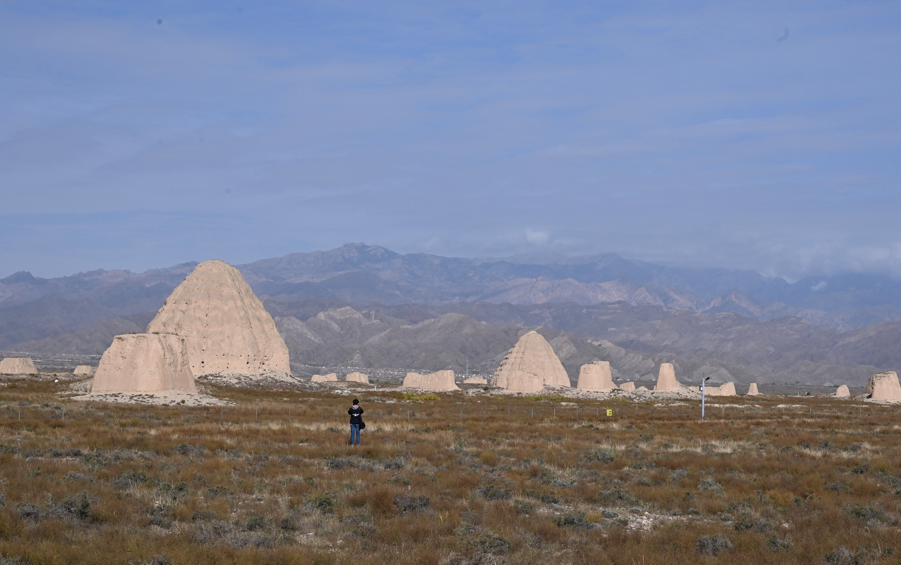

# 十一游记

## 山西

### 太原三日

### 运城二日

## 宁夏

### 银川三日

西夏陵

一段很有意思的 `callback`  
今年年初的时候去了一次保定，吃驴肉火烧  
吃完驴火消化等下顿的时候，看到旁边有个古莲花池公园，旁边的长廊里有一排碑，看到其中一个上面写着西夏文（西夏文太有特点了），旁边也没有详细介绍说明。
当时还非常纳闷为什么河北保定一个公园里竟然会有西夏文的古碑。  
然后这次到西夏陵，在博物馆里听讲解介绍，那块碑竟然是西夏历史发现的很重要文物；另外在宁夏博物馆里也有提到那块在保定公园里的古碑。

### 吴忠二日
