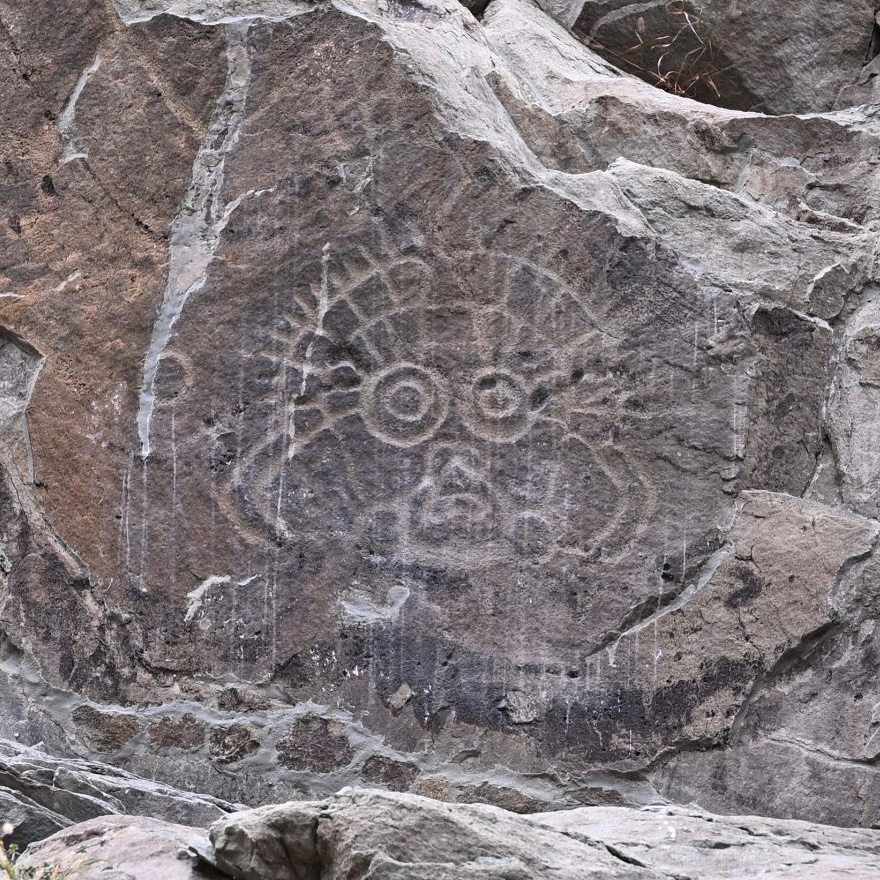
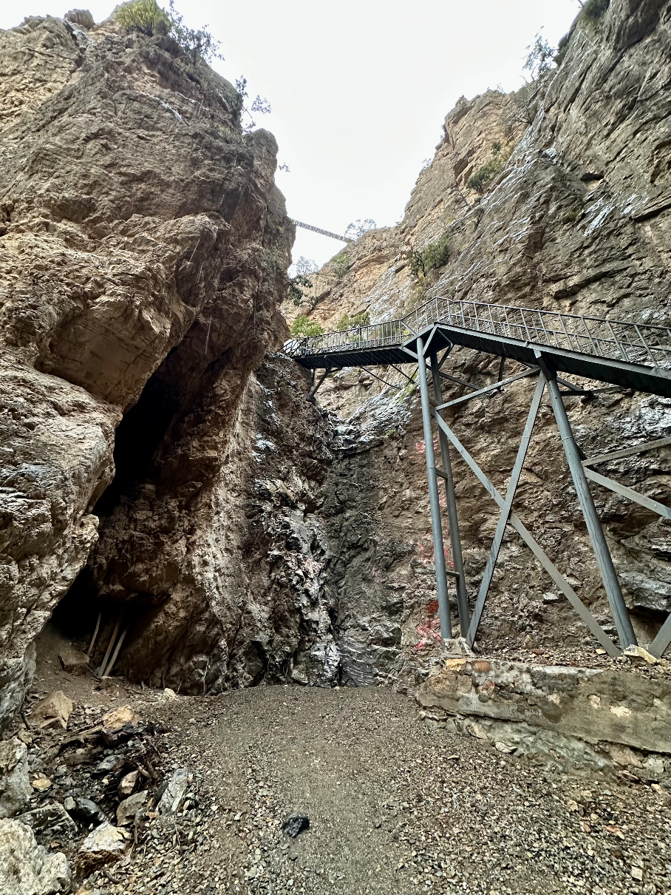
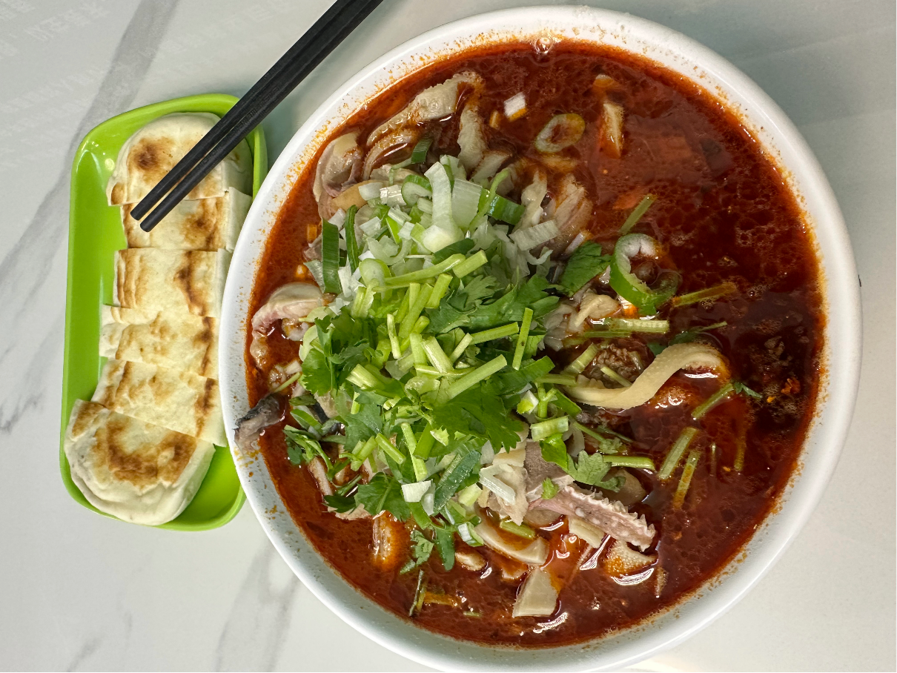

# 十一游记

规划很早的十一旅游，包含了太原、银川、乌海、呼和浩特，后各种意外，最终如下：

## 山西

### 太原三日

#### 晋祠

早上先去简单逛了一圈省博，无特别记录。

出来去晋祠，之后几天万分庆幸挑选了十一前一天逛晋祠，避免了人从众。

大圣

这块匾好好看

86版西游场景

🐉

#### 平遥双林寺

双林寺悬塑，跑了一天唯一的收获，再一次：*平遥古城是垃圾*。

#### 市区citywalk

原本后半晌计划是`太原北齐壁画博物馆`，结果打了车走到一半才想到自己忘记预约，遂作罢，修改目的地到附近的双塔公园。

太原双塔寺，太原的地标，没记错的话从小看天气预报，太原的背景就是此双塔。

### 运城二日

#### 飞云楼

外景

局部

香亭

#### 解州关帝庙

## 宁夏

### 银川三日

#### 贺兰山

出发贺兰山墙

太阳神

岩画玛尼堆

韩美林艺术馆

苏峪口国家森林公园

#### 西夏陵

西夏陵除了能在现场勾起历史的记忆之外，几乎所有的看点都来源于背后的贺兰山。

西夏陵双陵全景

**一段很有意思的 `callback`**  

今年年初的时候去了一次保定，吃驴肉火烧  
吃完驴火消化等下顿的时候，看到旁边有个古莲花池公园，旁边的长廊里有一排碑，看到其中一个上面写着西夏文（西夏文太有特点了），旁边也没有详细介绍说明。
当时还非常纳闷为什么河北保定一个公园里竟然会有西夏文的古碑。  
然后这次到西夏陵，在博物馆里听讲解介绍，那块碑竟然是西夏历史发现的很重要文物；另外在宁夏博物馆里也有提到那块在保定公园里的古碑。

**公交趣事**  

在西夏陵的摆渡车上，听到几个东北的大爷大妈聊天，

> 爬贺兰山下雨，湿了鞋，点外卖买了双鞋想着随便穿一天，结果连续跑了六天安然无恙的脚，换了新鞋第一天起了两个水泡

#### 银川citywalk

老西门羊杂碎

### 吴忠二日

食在吴忠
