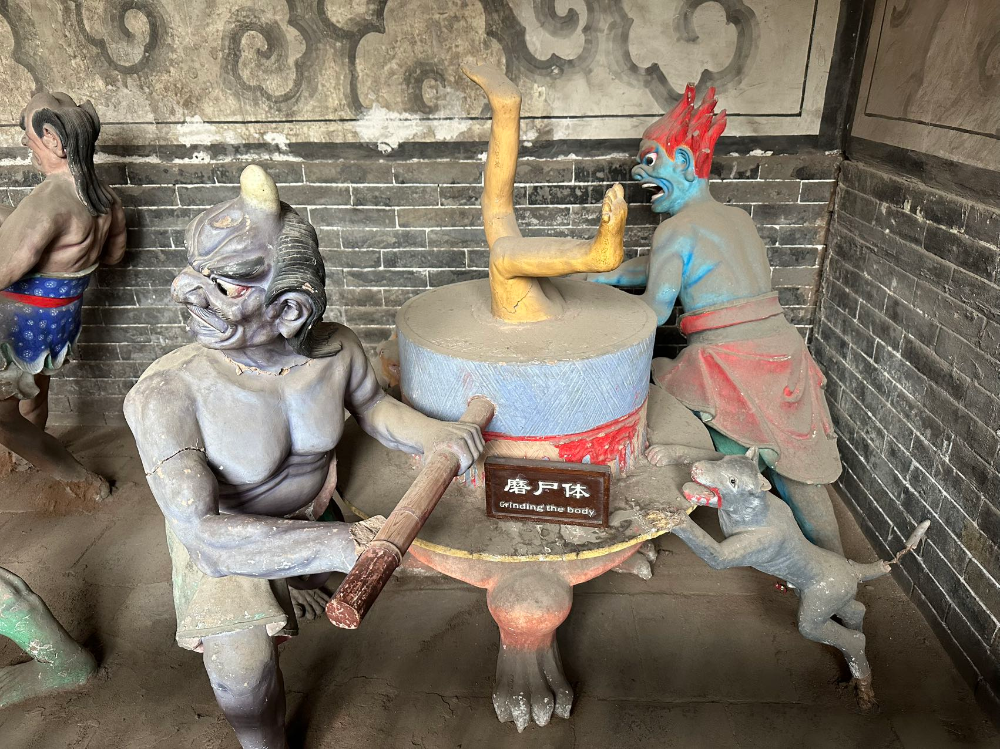

# 十一游记

规划很早的十一旅游，包含了太原、银川、乌海、呼和浩特，后各种意外，最终如下：

## 山西

### 太原三日

#### 晋祠

早上先去简单逛了一圈省博。

阔腿裤

现在的博物馆吃相太难看了，一个文创小玩具都要抽盲盒

出来去晋祠，之后几天万分庆幸挑选了十一前一天逛晋祠，避免了人从众。

大圣

这块匾好好看

86版西游场景

🐉

#### 平遥双林寺

双林寺悬塑，平遥跑了一天唯一的收获，再一次：*平遥古城是垃圾*。

殿里的悬塑讲述了佛祖的一生，其中一则故事讲一个出身旁门的女子，假装怀孕，非说是释迦牟尼弟子搞得，但却被帝释天揭穿骗局。如今这种事越来越常见了。

太可怕了

#### 市区citywalk

原本后半晌计划是`太原北齐壁画博物馆`，结果打了车走到一半才想到自己忘记预约，作罢，修改目的地到附近的双塔公园。

太原双塔寺，太原的地标，没记错的话从小看天气预报，太原的背景就是此双塔。

### 运城二日

#### 飞云楼

外景

局部

香亭

#### 解州关帝庙

## 宁夏

### 银川三日

#### 贺兰山

出发贺兰山墙

太阳神

岩画玛尼堆

韩美林艺术馆

苏峪口国家森林公园

怀远夜市

#### 西夏陵

西夏陵除了能在现场勾起历史的记忆之外，几乎所有的看点都来源于背后的贺兰山。

西夏陵双陵广角全景

莫名想到《A Horse With No Name》

**一段很有意思的 `callback`**  

今年年初的时候去了一次保定，吃驴肉火烧  
吃完驴火消化等下顿的时候，看到旁边有个古莲花池公园，旁边的长廊里有一排碑，看到其中一个上面写着西夏文（西夏文太有特点了），旁边也没有详细介绍说明。
当时还非常纳闷为什么河北保定一个公园里竟然会有西夏文的古碑。  
然后这次到西夏陵，在博物馆里听讲解介绍，那块碑竟然是西夏历史发现的很重要文物；另外在宁夏博物馆里也有提到那块在保定公园里的古碑。

**公交趣事**  

在西夏陵的摆渡车上，听到几个东北的大爷大妈聊天，

> 爬贺兰山下雨，湿了鞋，点外卖买了双鞋想着随便穿一天，结果连续跑了六天安然无恙的脚，换了新鞋第一天起了两个水泡

#### 银川citywalk

老西门羊杂碎

### 吴忠二日

**食在吴忠**  

到了吴忠怎么能不吃早茶呢，刚开始点了羊肉和烧麦，想着一定要加八宝茶啊，然后老板说不点拉面吗？我说吃不了，回：那给你个宝宝拉面。

#### 青铜峡黄河大峡谷

#### 吴忠citywalk

看装修谁敢想这是吃羊杂的地方呢

#### 转车呼和浩特

泽成冰煮羊，有点儿贵啊，一人吃了185

